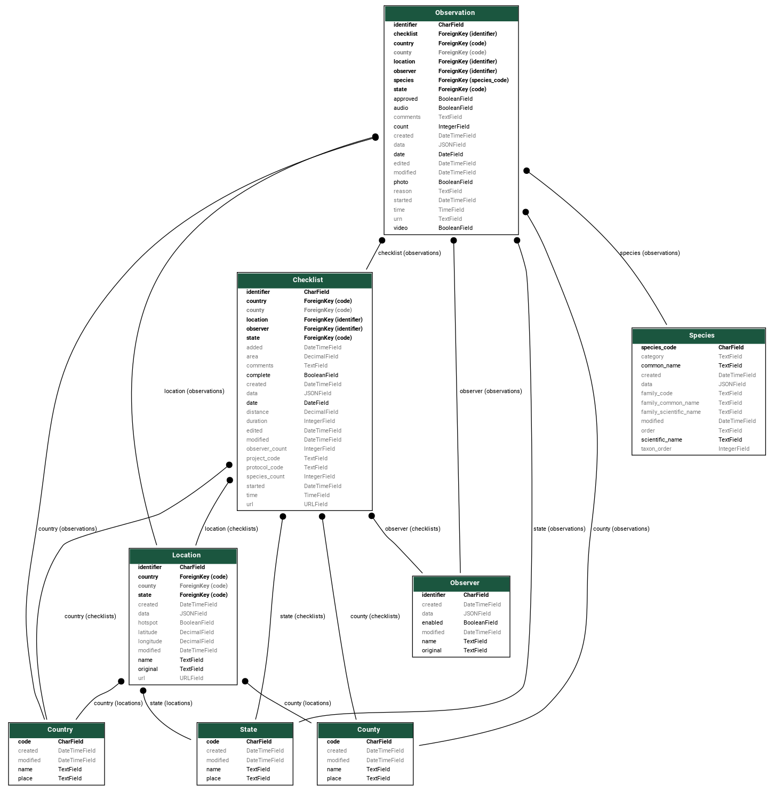

===============
Database Schema
===============
ebird-api-data loads the data into five Django model: Checklist, Location,
Observer, Observation and Species:

The lightning tour in 20 seconds:

* A Checklist has a Location.
* A Checklist has an Observer.
* A Checklist has a Location.
* A Checklist has a list of Observations.
* An Observation belongs to a Checklist.
* An Observation has a Species.
* An Observation has a Location.
* An Observation has an Observer.
* A Location has a Country.
* A Location has a State.
* A Location has a County.

Notes
-----
1. Observer is duplicated on Observation to make queries easy.

2. Country, State and County are duplicated on Checklist and Observation
   to make queries easy.

3. The models use TextField as it works equally well with SQLite3 and PostgreSQL
   as CharField. This means there will not be a problem if the size of strings
   from eBird get longer.

4. The Observer is the person who submitted the checklist to eBird. If the checklist
   was shared or other people in the group also submitted a checklist then the `group`
   attribute on `Checklist` will contain an identifier which can be used to link
   them together.

5. Each of the models has a JSONField for adding features without having to
   add migrations. This proved useful during development, until features
   stabilised so the fields were left as a convenience.

6. On Species, the common name and family common names are stored as dict,
   using the language code as a key:

    .. code-block:: json

        {
           "en": "Gray Plover",
           "en-UK": "Grey Plover",
           "en-US": "Black-bellied Plover",
           "es": "Chorlito gris",
           "es-MX": "Chorlo Gris",
           "es-CL": "Chorlo ártico",
        }

   Custom fields, TranslationCharField and TranslationTextField allow you
   to easily edit the values in the Django Admin.

7. For Location and Observer, there are two name fields: name and original.
   The original field contains the value from eBird, and name field is the
   cleaned, display name. The APILoader sets both fields to the value from
   the eBird data, but you can use a pre-save signal to overwrite the name
   field.

   For example, the eBird site names have extra information added to help
   identify all the sites in a given area, and also indicate any access
   restrictions. For example:

     .. code-block:: console

        RN Estuário do Tejo--Ponta da Erva (acesso condicionado).

   You can use the pre-save signal to set the name field to show a cleaned
   version instead:

     .. code-block:: console

        Ponta da Erva

   Locations for incidental observations also contain the coordinates. You
   can use the pre-save signal to remove those also.

   Here is the code used to clean locations in `eBirders PT`_:

    .. code-block:: python

        import re

        from django.db.models.signals import pre_save
        from django.dispatch import receiver

        from data.models import Location

        # +/- 90 degrees with comma or period for the decimal point,
        # followed by 2-5 decimal places.
        latitude_regex = r"-?\d{1,2}[.,]\d{1,7}"

        # +/- 180 degrees with comma or period for the decimal point,
        # followed by 2-5 decimal places.
        longitude_regex = r"-?\d{1,3}[.,]\d{1,7}"

        # Latitude and longitude, separated by comma, and/or optional space,
        # surrounded by optional round brackets, and preceded with anm optional
        # comma and a space. The initial part of the name is captured in a
        # group for the next step. The word boundary is added since the .*
        # is greedy, consume the comma, and so the match will fail.
        coordinates_regex = r"^(.*)\b,? (:?\()?%s, ?%s(:?\))?$" % (
            latitude_regex, longitude_regex
        )

        # Country code (hard-wired to PT). The initial part of the name
        # is captured in a group for the next step.
        country_regex = r"^(.*), PT$"

        # Country code (hard-wired to PT), followed by the region name,
        # which might be in any language. The initial part of the name
        # is captured in a group for the next step.
        region_regex = r"^(.*) PT-\w+$"

        def remove_coordinates(name: str) -> str:
            if re.match(coordinates_regex, name):
                name = re.sub(coordinates_regex, r"\1", name)
            return name

        def remove_country(name: str) -> str:
            if re.match(country_regex, name):
                name = re.sub(country_regex, r"\1", name)
            return name

        def remove_region(name: str) -> str:
            if re.match(region_regex, name):
                name = re.sub(region_regex, r"\1", name)
            return name

        def remove_state(name: str) -> str:
            """Remove the county or state.

            The location name, particularly for private locations is a comma
            separated list of the place, town and county. The latter might be
            the district (state) since counties, and districts are often named
            after the principal town or city.
            """
            elements = name.split(",")
            if len(elements) == 3:
                del elements[2]
                name = ",".join(elements)
            return name

        def remove_duplicates(name: str) -> str:
            """The name of larger towns and cities is shared with the county
            or district so duplicate names are treated as the general area
            for the town or city."""
            elements = name.split(",")
            if len(elements) == 2 and elements[0] == elements[1]:
                name = "%s-área-geral" % elements[0]
            return name

        def remove_access(name: str) -> str:
            if name.endswith(" (acesso condicionado)"):
                name = name.replace(" (acesso condicionado)", "")
            elif name.endswith(" - acesso condicionado"):
                name = name.replace(" - acesso condicionado", "")
            elif name.endswith(" (Acesso Condicionado)"):
                name = name.replace(" (Acesso Condicionado)", "")
            elif name.endswith(", Acesso Condicionado"):
                name = name.replace(", Acesso Condicionado", "")
            elif name.endswith("--Acesso Condicionado"):
                name = name.replace("--Acesso Condicionado", "")
            elif name.endswith(" (acesso restrito)"):
                name = name.replace(" (acesso restrito)", "")
            elif name.endswith(" (Acesso Restrito)"):
                name = name.replace(" (Acesso Restrito)", "")
            return name

        def remove_freguesias(name):
            if "União das freguesias" in name:
                name = name.split(",")[0]
            return name

        def generate_name(name) -> str:
            cleaned = remove_coordinates(name)
            cleaned = remove_country(cleaned)
            cleaned = remove_region(cleaned)
            cleaned = remove_state(cleaned)
            cleaned = remove_access(cleaned)
            cleaned = remove_freguesias(cleaned)
            cleaned = remove_duplicates(cleaned)
            return cleaned

        @receiver(pre_save, sender=Location)
        def set_location_name(sender, instance, **kwargs):
            if instance.pk is None:
                instance.name = generate_name(instance.original)

   This works well with locations for Portugal, but you can easily see,
   cleaning is location specific. There is also some variation in the way
   eBird adds coordinates to the names of incidental locations, with
   different platforms, and possibly countries, adding coordinates
   in different formats.

.. _eBirders PT: https://www.ebirders.pt/
